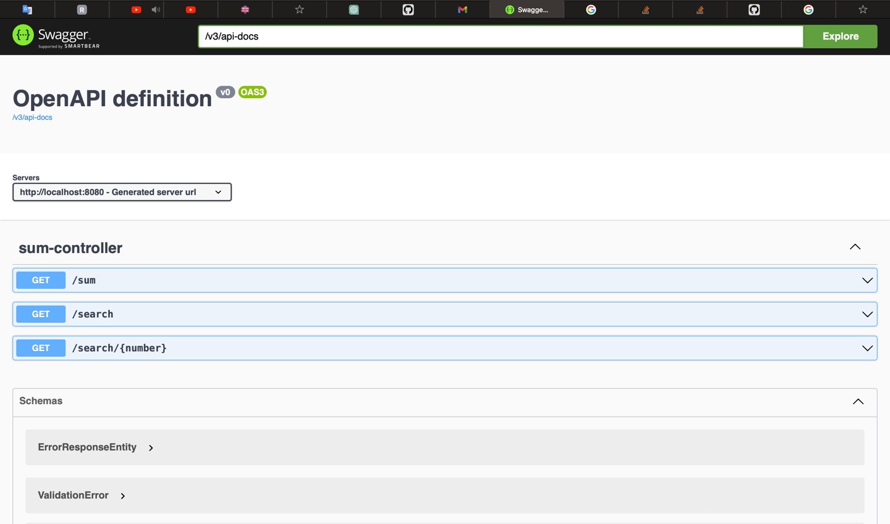

# Introduction
This work provides ability to summarize two integers, as well as request one of previous cases of summarization by sum or addend

This work was written as a home assignment for Police and Border Guard Board

## Technical Stack

Database
- PostgreSQL

Back-End
- Spring Boot 3.1
- Swagger - UI

# Run instruction

### Docker Compose
The project uses Docker with Docker Compose for containerization and deployment the application

Command for running the application via Docker Compose:  
```docker-compose up ```

Docker Compose creates Docker containers for every part of the application.
If containers should be deleted, use Docker Compose command:  
```docker-compose down```

### Default URL addresses

- Application: ```http://localhost:8080```

# Entry points

[Swagger-UI](http://localhost:8080/api/swagger-ui/index.html) (The application should be run)


